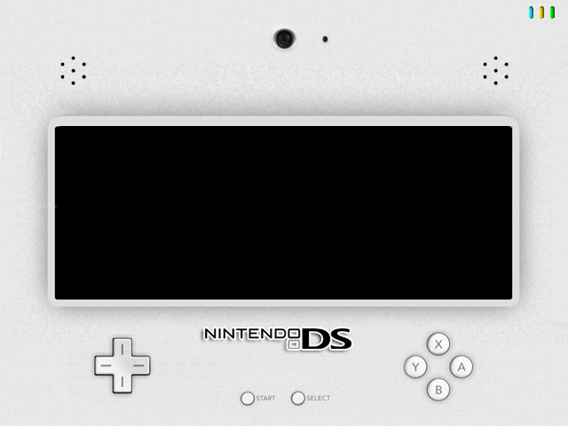
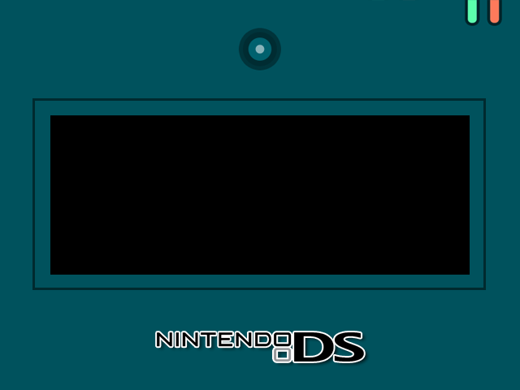
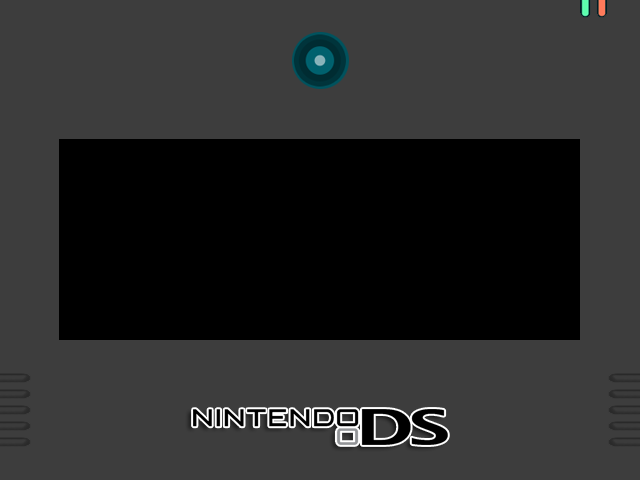
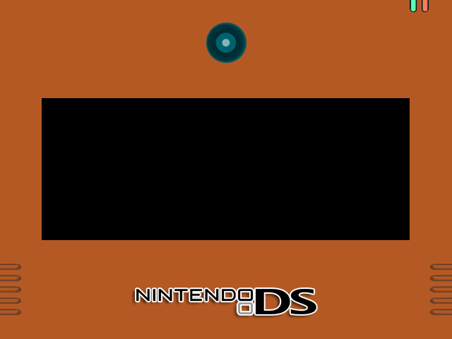
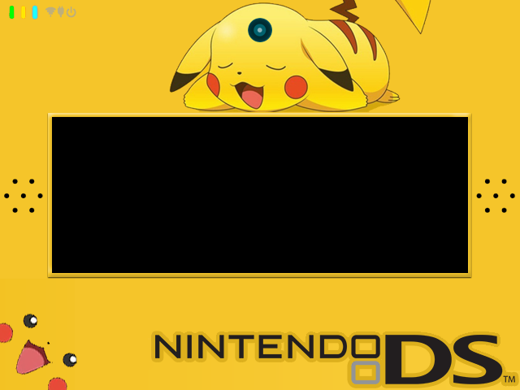
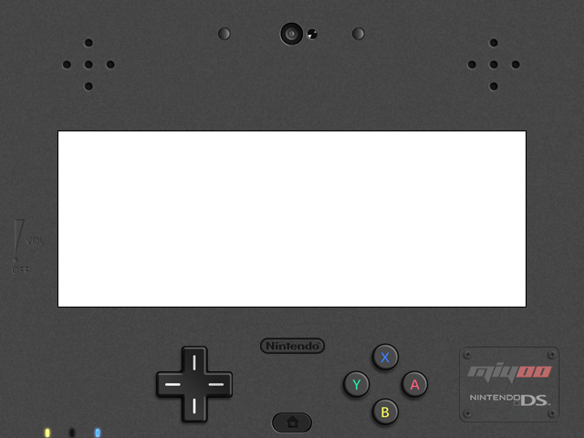
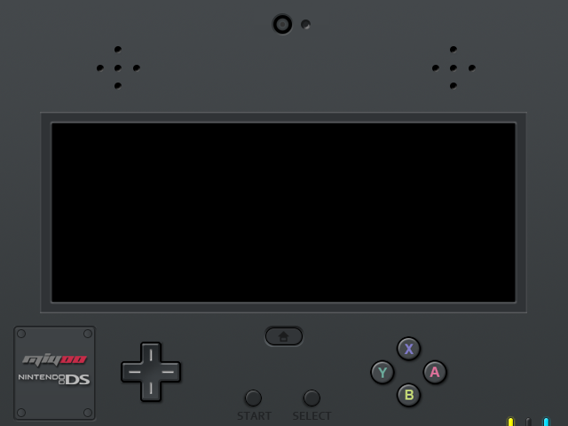
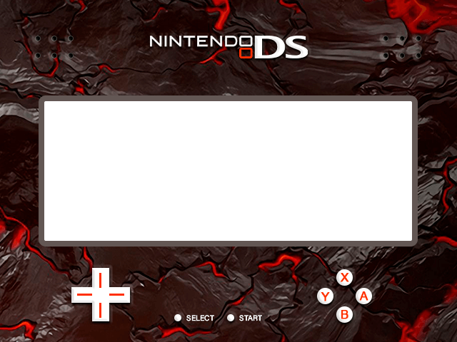
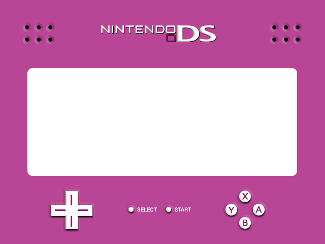

# dArkOS-RE_NDS_Overlay_Selector
A simple tool to swap between different NDS Overlay presets

<h1>Overlay Previews</h1>
<b>1</b>

<b>2</b>

<b>3</b>

<b>4</b>

<b>5</b>

<b>6</b>

<b>7</b>

<b>8</b>

<b>9</b>

